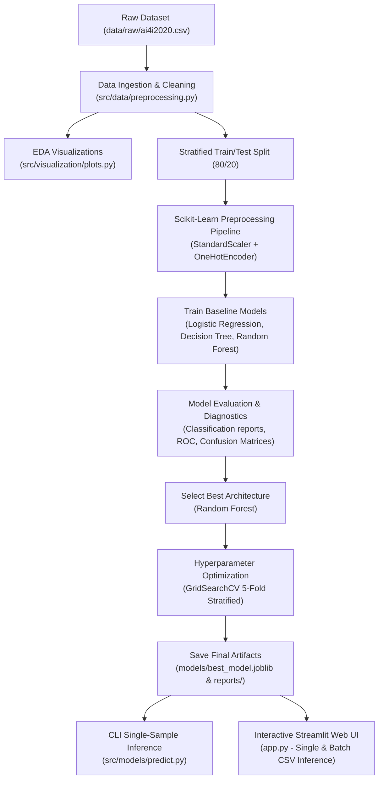

# Predictive Maintenance ML: Project Structure, Flow, and Core Fundamentals (What, How, When, Why)

This document provides a comprehensive technical overview of the Predictive Maintenance Machine Learning project, breaking down its directory structure, end-to-end execution flow, and the core **What, How, When, and Why** behind its architectural and machine learning decisions.

---

## 1. Project Structure

The project adheres to a modular package architecture located under `src/` coupled with an interactive web UI layer in `app.py`:

```
predictive-maintenance-ml/
├── data/
│   ├── raw/                              # Source dataset (ai4i2020.csv)
│   └── processed/                        # Preprocessed splits / cache
├── models/
│   └── best_model.joblib                 # Serialized end-to-end tuned pipeline artifact
├── notebooks/
│   └── exploratory_analysis.ipynb        # Interactive Jupyter notebook for exploratory demo
├── reports/
│   ├── figures/                          # Saved EDA charts, ROC curves, confusion matrices
│   ├── logs/                             # Execution logs (pipeline.log)
│   └── results/                          # Metric CSV tables (comparison, tuned, feature importance)
├── src/
│   ├── __init__.py
│   ├── config.py                         # Single source of truth (paths, columns, seed, hyperparameters)
│   ├── logger.py                         # Centralized logging setup
│   ├── run_pipeline.py                   # Master orchestration script
│   ├── data/
│   │   ├── __init__.py
│   │   └── preprocessing.py              # Ingestion, cleaning, splitting & ColumnTransformer definitions
│   ├── models/
│   │   ├── __init__.py
│   │   ├── train.py                      # Baseline models construction and fitting
│   │   ├── evaluate.py                   # Metrics evaluation, classification reports, ROC & confusion matrix
│   │   ├── tune.py                       # GridSearchCV hyperparameter optimization on Random Forest
│   │   └── predict.py                    # CLI inference script for real-time / single-sample predictions
│   └── visualization/
│       ├── __init__.py
│       └── plots.py                      # Dedicated visualization routines
├── app.py                                # Streamlit Web UI for interactive & batch predictions
├── BUILD_SPEC.md                         # Detailed project specification
├── PROJECT_EXPLAINED.md                  # Comprehensive conceptual walkthrough
├── README.md                             # Quickstart and project summary
└── requirements.txt                      # Project dependencies
```

---

## 2. End-to-End Execution Flow



### Flow Breakdown:

1. **Data Ingestion & Cleaning (`src/data/preprocessing.py`)**:
   - Reads the raw dataset from `data/raw/ai4i2020.csv`.
   - Cleans and standardizes column names.
   - Drops non-informative identifier columns (`UDI`, `Product_ID`).
   - Identifies and isolates potential target leakage columns (`TWF`, `HDF`, `PWF`, `OSF`, `RNF`).

2. **Exploratory Data Analysis (`src/visualization/plots.py`)**:
   - Generates and saves visual reports to `reports/figures/` (failure distribution, feature correlation heatmaps, numerical boxplots, and categorical breakdown by product type).

3. **Stratified Splitting & Preprocessing**:
   - Splits data using an 80/20 stratified split preserving the ~3.4% failure rate across partitions.
   - Sets up a `ColumnTransformer` that applies `StandardScaler` to continuous sensor features and `OneHotEncoder(drop='first')` to the categorical `Type` column.

4. **Baseline Model Training (`src/models/train.py`)**:
   - Builds complete `Pipeline` objects bundling preprocessing with three classifiers:
     - Logistic Regression
     - Decision Tree Classifier
     - Random Forest Classifier
   - Trains all three on the training set.

5. **Evaluation & Comparison (`src/models/evaluate.py`)**:
   - Evaluates each model on the held-out test set across key metrics: Accuracy, Precision, Recall, F1-Score, and ROC-AUC.
   - Generates confusion matrices, ROC curves, and a comparative performance chart.

6. **Hyperparameter Tuning (`src/models/tune.py`)**:
   - Runs `GridSearchCV` (5-fold stratified cross-validation across 81 hyperparameter combinations = 405 fits) optimizing F1-score on Random Forest.

7. **Serialization & Artifact Export**:
   - Saves the final fitted model pipeline to `models/best_model.joblib`.
   - Saves evaluation results, feature importances, and execution logs to `reports/`.

8. **Inference & UI Serving (`src/models/predict.py` & `app.py`)**:
   - **CLI Inference (`src/models/predict.py`)**: Accepts raw unscaled sensor inputs and outputs failure predictions with confidence probabilities via terminal.
   - **Streamlit Web UI (`app.py`)**: Provides interactive machine telemetry sliders, preset operating scenarios, real-time derived physical metrics ($\Delta T$ and Power in kW), diagnostic status cards, and batch CSV upload with predictions export.

---

## 3. The WHAT, HOW, WHEN, and WHY

| Dimension | Detailed Breakdown |
|---|---|
| **WHAT** | **Predictive Maintenance Binary Classifier & Web Interface**<br>• Uses historical sensor readings from industrial milling machines (temperatures, rotational speed, torque, tool wear) to predict whether machine failure is imminent (`Machine_Failure` = 0 or 1). |
| **HOW** | **Modular Python Architecture & Scikit-Learn Pipelines**<br>• Built with pure Python modules and centralized configuration (`src/config.py`).<br>• Integrates feature transformations directly inside `Pipeline` objects to prevent data leakage.<br>• Mitigates severe class imbalance (3.4% failures) using `class_weight='balanced'`.<br>• Systematically optimizes model hyperparameters via 5-fold `GridSearchCV`.<br>• Provides both CLI inference and a full Streamlit Web UI (`app.py`).<br>• Executed as a full pipeline (`python -m src.run_pipeline`) or modularly by stage. |
| **WHEN** | **Usage Scenarios**<br>• **Full Pipeline Retraining**: When new telemetry data is collected (`python -m src.run_pipeline`).<br>• **Sub-Module Inspection & Debugging**: Running individual phases (data loading, baseline training, or tuning).<br>• **Terminal-Based Spot Check**: Quick single-reading verification (`python -m src.models.predict`).<br>• **Interactive Dashboard / Operator Use**: Live machine diagnosis and batch CSV log screening (`streamlit run app.py`). |
| **WHY** | **Architectural & ML Decision Rationale** *(Detailed below)* |

---

## 4. Key Design Decisions ("The WHY")

### 1. Why isolate failure modes (`TWF`, `HDF`, `PWF`, `OSF`, `RNF`)?
* **Reason**: These columns represent the *cause* of the failure (Tool Wear Failure, Heat Dissipation Failure, Power Failure, Overstrain Failure, Random Failure).
* **Impact**: If included in features, the model would simply check if any failure mode equals 1, causing severe **target leakage**. The model would achieve near 100% artificial accuracy in validation but fail completely when deployed on real-time operational machines.

### 2. Why use `class_weight='balanced'` instead of standard training?
* **Reason**: Only 3.4% (339 out of 10,000) of samples are failures.
* **Impact**: A naive model with default loss would predict "No Failure" every single time, yielding 96.6% accuracy while failing to detect 100% of real breakdowns. `class_weight='balanced'` penalizes misclassification of the minority failure class proportionally, optimizing for F1-Score and Recall.

### 3. Why bundle preprocessing into `Pipeline` and `ColumnTransformer`?
* **Reason**: Fitting scalers or encoders on the whole dataset before splitting leaks test set statistics (mean, variance) into training (**data leakage**).
* **Impact**: Encapsulating transformers inside `Pipeline` ensures they are fit strictly on training folds. Additionally, the saved `best_model.joblib` accepts raw, unscaled inputs directly without requiring manual preprocessing steps during inference or in the Streamlit application.

### 4. Why use Stratified Splitting?
* **Reason**: Due to the small number of failure events, pure random splitting can cause significant distribution variance between train and test sets.
* **Impact**: `StratifiedKFold` and stratified `train_test_split` guarantee that both training and testing partitions retain the exact ~3.4% failure prevalence.

### 5. Why tune only Random Forest?
* **Reason**: Baseline comparisons showed Random Forest significantly outperforming Logistic Regression and Decision Trees in F1-score and ROC-AUC.
* **Impact**: Running extensive grid searches across all models would waste compute without altering the final production model selection.

### 6. Why build a Streamlit Web UI (`app.py`)?
* **Reason**: Machine operators and maintenance engineers need a visual, user-friendly interface to test sensor parameters, examine failure risk, and run batch predictions on sensor log CSV files without running Python terminal commands.
* **Impact**: Empowers non-technical stakeholders to interact directly with the trained model and download batch predictions.

### 7. Why centralize settings in `src/config.py` and fix `RANDOM_STATE = 42`?
* **Reason**: Hardcoded values scattered across scripts lead to configuration drift and reproducibility issues.
* **Impact**: `src/config.py` provides a single point of truth for paths, column definitions, and hyperparameter grids, while a constant seed guarantees deterministic and reproducible results.
